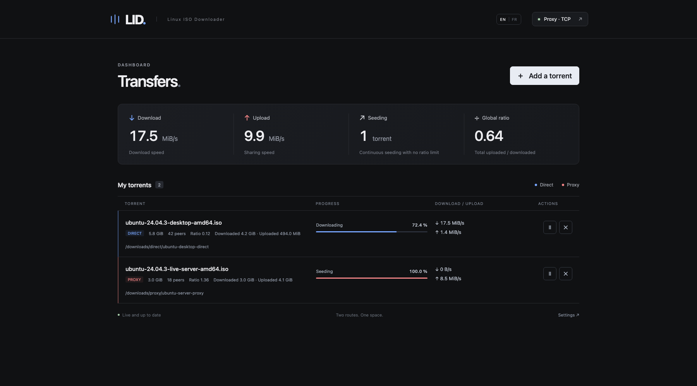
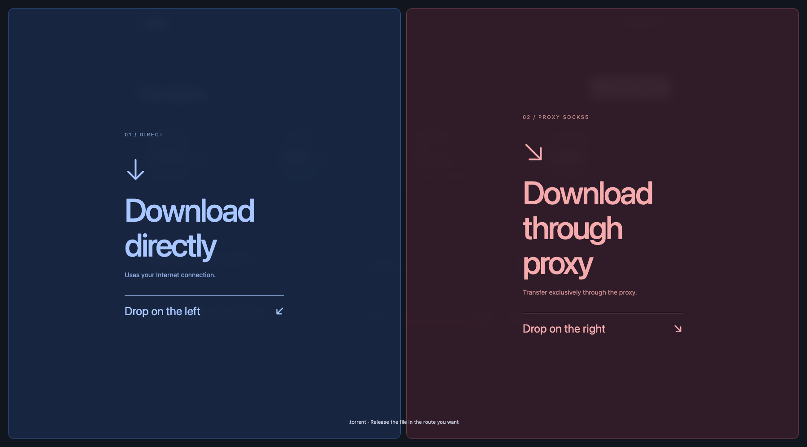

# LID — Linux ISO Downloader

LID is a local FastAPI torrent client with a minimal vanilla HTML, CSS and JavaScript interface. It runs independent direct and SOCKS5 sessions, supports `.torrent` files and magnet links, keeps seeding after completion, and can move completed downloads to another disk.



### Drop zones



## Setup and launch

LID requires macOS or Linux and Python 3.12.

```sh
git clone https://github.com/J4GL/LID.git
cd LID
./run.sh
```

Open [http://127.0.0.1:8000](http://127.0.0.1:8000). On first launch, configure storage, network and performance settings in the setup screen. Torrent engines remain stopped until setup is complete.

`run.sh` creates the virtual environment, installs pinned dependencies and checks the configured ports. Stop LID with `Ctrl+C`.

On a Linux system using systemd, enable automatic startup with:

```sh
sudo ./install-service.sh
```

Without root access, enable systemd lingering once and install a user service:

```sh
loginctl enable-linger "$USER"
./install-service.sh --user
```

Proxy mode is optional and disabled by default. When enabled, it is fail-closed: proxy torrents never fall back to the direct connection.

## Development

```sh
.venv/bin/python -m pip install -r requirements-dev.txt
.venv/bin/pytest -q
node --test tests/drop.test.mjs tests/i18n.test.mjs
```

Licensed under [CC0 1.0 Universal](LICENSE).
